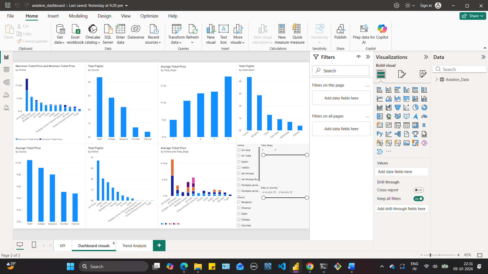
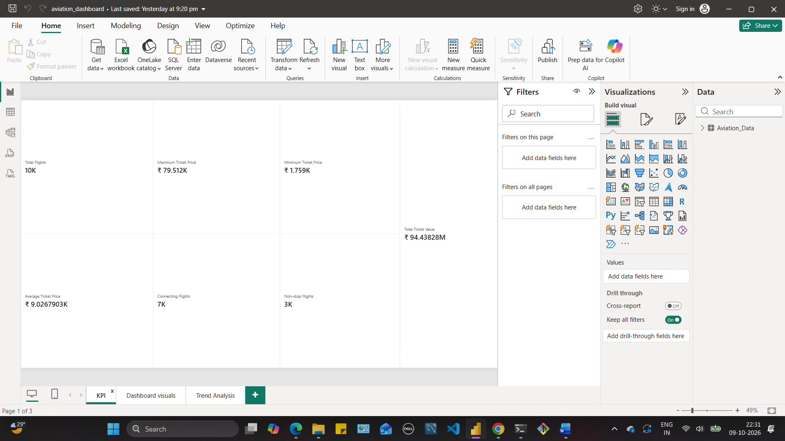
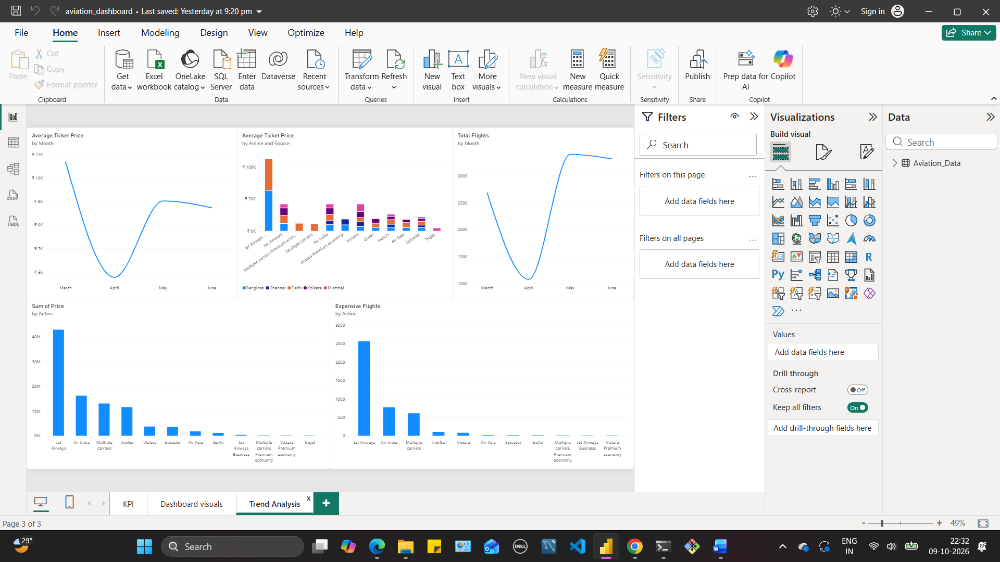

# Aviation Data Analysis

## Project Overview

This project focuses on analyzing airline ticket prices, flight distribution, routes, and travel patterns using Excel, SQL, Python, and Power BI. The objective is to explore the factors associated with ticket-price variations and identify patterns across airlines, source and destination cities, and the number of stops.

The project follows an end-to-end data analysis workflow, from working with the dataset to querying, visualization, and presenting insights through a Power BI dashboard.

## Tools and Technologies

- **Microsoft Excel:** Data analysis, formulas, PivotTables, and charts
- **MySQL:** Data querying, aggregation, filtering, and ranking
- **Python:** Data analysis using Pandas and Jupyter Notebook
- **Power BI:** KPI cards, dashboard visualizations, and trend analysis
- **Git and GitHub:** Version control and project documentation

## Dataset Overview

The project uses flight booking data containing information about airlines, journey dates, source and destination cities, routes, departure and arrival times, flight duration, number of stops, additional information, and ticket prices.

**Dataset files:**
- `Data_Train.csv` — Raw dataset
- `Aviation_Analysis Final_DATASET.xlsx` — Dataset and Excel analysis workbook

### Key Columns

| Column | Description |
|---|---|
| Airline | Airline operating the flight |
| Date_of_Journey | Journey date |
| Source | Departure city |
| Destination | Arrival city |
| Route | Flight route |
| Dep_Time | Departure time |
| Arrival_Time | Arrival time |
| Duration | Flight duration |
| Total_Stops | Number of stops |
| Additional_Info | Additional flight information |
| Price | Ticket price |

## Project Workflow

1. Prepared the aviation dataset for analysis.
2. Performed exploratory analysis using Excel formulas, summary tables, and PivotTables.
3. Used SQL queries to answer business questions related to ticket prices, flight counts, routes, and airlines.
4. Conducted Python-based analysis using Pandas in Jupyter Notebook.
5. Developed a Power BI report to present key metrics, comparisons, and monthly trends.
6. Reviewed the results to identify patterns in airline pricing and flight distribution.

## Excel Analysis

Excel was used to analyze ticket prices and flight distribution through formulas, PivotTables, and charts.

The analysis included:

- Average ticket price by airline
- Minimum and maximum ticket prices
- Flight counts by source and destination
- Average ticket price by source city
- Airline-wise flight counts
- Average ticket prices by number of stops
- Airline comparisons across source cities and stop categories
- Formula-based ticket-price classification

### Excel Techniques Used

`COUNTIF`, `COUNTIFS`, `SUMIF`, `SUMIFS`, `AVERAGEIF`, `AVERAGEIFS`, `XLOOKUP`, `INDEX`, `MATCH`, `IFS`, PivotTables, and PivotCharts.

### Observations

The analysis highlights differences in average ticket prices across airlines and source cities. It also compares flight volumes by location and examines how average prices vary with the number of stops.

### Excel Screenshots

**Excel Analysis**


**PivotTable Analysis**


**Formula-Based Analysis**


## SQL Analysis

MySQL was used to analyze the dataset and answer business questions related to airline pricing and flight distribution.

### Business Questions

1. How many flights are present in the dataset?
2. What are the average, minimum, and maximum ticket prices for each airline?
3. What is the total ticket value for each airline?
4. How many flights does each airline operate?
5. How do average ticket prices vary by airline and source city?
6. Which airlines have an average ticket price greater than ₹10,000?
7. How many flights fall into each ticket-price category?
8. How many expensive flights does each airline have?
9. What is the average ticket price for flights with one stop or fewer?
10. How many distinct routes does each airline operate?
11. Which airlines have an average ticket price above the overall dataset average?
12. How can airlines with average prices above ₹10,000 be identified using a CTE?
13. How can airlines be ranked by average ticket price?

### SQL Concepts Used

- Aggregate functions: `COUNT()`, `SUM()`, `AVG()`, `MIN()`, and `MAX()`
- `GROUP BY` and `HAVING`
- Conditional logic using `CASE WHEN`
- Conditional aggregation
- `DISTINCT`
- Subqueries
- Common Table Expressions (CTEs)
- Window functions using `RANK()`
- Filtering and sorting

**SQL file:** `Aviation_Analysis.sql`

## Python Analysis

Python was used as part of the data analysis workflow, with Pandas for working with the dataset in Jupyter Notebook.

**Notebook:** `AVIATION_Analysis.ipynb`

The notebook is included in the repository for reference and review.

## Power BI Dashboard

The Power BI report contains three pages: KPI, Dashboard Visuals, and Trend Analysis.

### 1. KPI Overview

The KPI page summarizes key metrics, including:

- Total flights
- Maximum and minimum ticket prices
- Average ticket price
- Total ticket value
- Connecting flights
- Non-stop flights

### 2. Dashboard Visuals

The dashboard presents comparisons of:

- Maximum and minimum ticket prices by airline
- Flight counts by source and destination
- Average ticket prices by number of stops
- Average ticket prices by source city
- Flight counts by airline
- Average ticket prices by airline and number of stops

Filters for airline, source city, number of stops, and journey date support further exploration of the data.

### 3. Trend Analysis

The trend-analysis page examines:

- Average ticket price by month
- Total flight count by month
- Average ticket price by airline and source city
- Total ticket value by airline
- Expensive flights by airline

The monthly charts show changes in average ticket prices and flight counts across the months represented in the dataset.

### Power BI Screenshots

**Dashboard Visuals**



**KPI Overview**



**Trend Analysis**



**Power BI file:** `aviation_dashboard.pbix`

## Key Observations

- Average ticket prices differ across airlines and source cities.
- Flight distribution varies across source and destination locations.
- The analysis identifies differences in average ticket prices across stop categories.
- Monthly visualizations show changes in ticket prices and flight volumes.
- Combining Excel, SQL, Python, and Power BI provides complementary ways to analyze and present the dataset.

These observations describe patterns in the available data and do not establish causal relationships.

## Repository Structure

```text
Aviation-Data-Analysis/
│
├── Data_Train.csv
├── Aviation_Analysis Final_DATASET.xlsx
├── AVIATION_Analysis.ipynb
├── Aviation_Analysis.sql
├── aviation_dashboard.pbix
│
├── Ex_Aviation_Analysis 1.png
├── Ex_Aviation_Analysis 2.png
├── Ex_Pivot_Analysis 1.png
├── Ex_Pivot_Analysis 2.png
├── Excel_analysis 1.png
│
├── PB_Dashboard_Analysis.png
├── PB_KPI_Analysis.png
└── PB_Trend_Analysis.png
```

## Conclusion

This project demonstrates the application of Excel, SQL, Python, and Power BI in an end-to-end data analysis workflow. It explores airline ticket pricing, flight distribution, and route characteristics through structured queries, spreadsheet analysis, and dashboard visualizations.

The project provided practical experience in data analysis, business-question formulation, data summarization, and communicating findings through visual reports.

---

**Tools:** Excel | MySQL | Python | Pandas | Jupyter Notebook | Power BI | Git | GitHub
